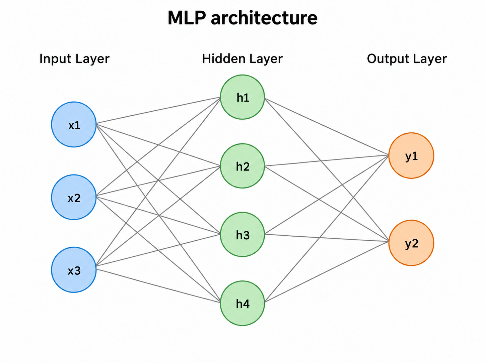
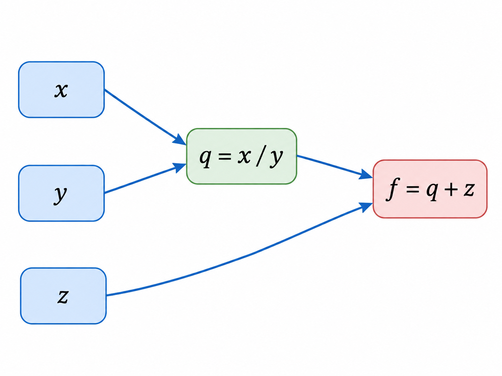
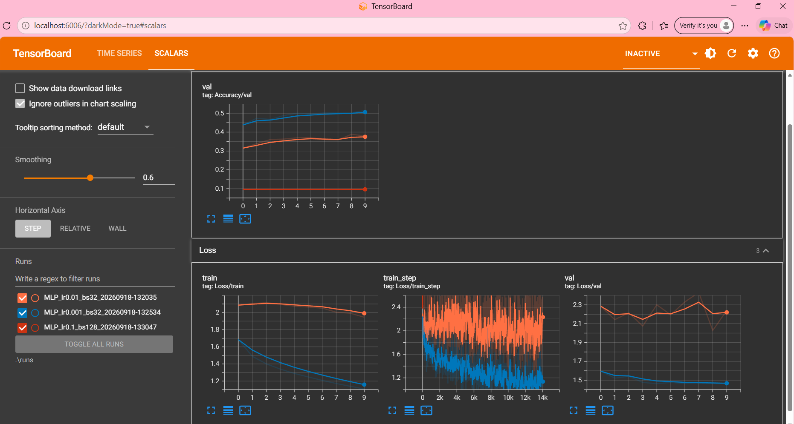
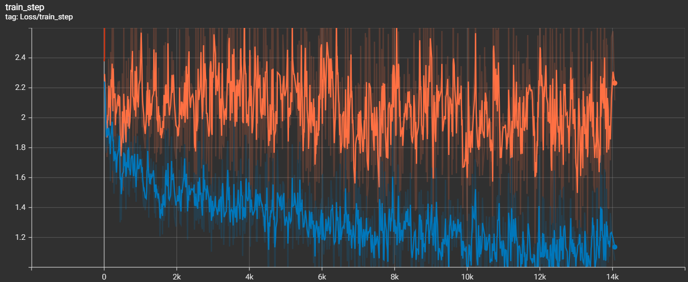
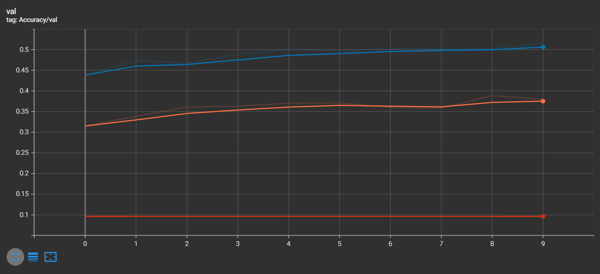
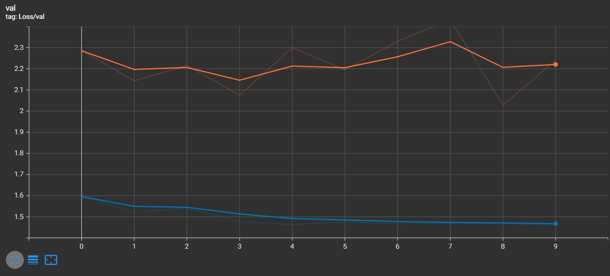

# TP1 — Premiers pas en Deep Learning

**Nom :** FATHALLI Zayneb
**Date :** 18/09/2026  

---

## Objectifs

L'objectif de ce TP est de prendre en main l'environnement de calcul du cluster, d'utiliser SLURM pour réserver des ressources, de créer un environnement Python reproductible avec PyTorch et CUDA, de revoir les bases théoriques d'un perceptron multicouche, puis d'entraîner et d'évaluer un premier réseau de neurones sur CIFAR-10. La dernière partie utilise TensorBoard pour suivre les métriques et comparer plusieurs jeux d'hyperparamètres.

---

# Exercice 1 — Utilisation de SLURM


## 1.c — Premier pas en mode interactif avec `srun`

La commande utilisée pour demander une ressource GPU interactive avec les contraintes du TP est :

```bash
srun --partition=gpu --gres=gpu:1 --time=01:00:00 --cpus-per-task=1 --mem=8G --pty bash
```

Une fois la ressource allouée, la commande :

```bash
nvidia-smi
```

permet d'identifier le GPU attribué.

Lors de la première allocation interactive utilisée pour cet exercice, le GPU attribué était :

```text
NVIDIA L4
```

Lors d'une allocation ultérieure utilisée pour vérifier PyTorch/CUDA, un autre nœud du cluster a attribué :

```text
NVIDIA H100 NVL MIG 1g.12gb
```

Cela montre que le modèle de GPU peut varier selon le nœud attribué par SLURM.

---

## 1.d — Observer et annuler un job

Les jobs peuvent être observés avec :

```bash
squeue
```

ou, pour filtrer sur l'utilisateur :

```bash
squeue -u $USER
```

La commande utilisée pour annuler le premier job interactif était :

```bash
scancel 1582
```

---

## 1.e — Soumettre un script avec `sbatch`

Un script `hello.sh` a été soumis avec `sbatch`.

La commande utilisée était :

```bash
sbatch hello.sh
```

Le job obtenu portait l'identifiant :

```text
1589
```

Le fichier de sortie principal généré dans le dossier `logs/` était :

```text
logs/hello-slurm-1589.out
```

Le job s'est terminé correctement et affichait notamment les informations GPU ainsi que :

```text
Bonjour depuis SLURM !
```

---

## 1.f — Analyse du job avec `sacct`

La commande utilisée était :

```bash
sacct -j 1589 --format=JobID,State,Elapsed,MaxRSS,ReqMem,ReqCPUS
```

Résultat observé :

```text
1589          COMPLETED   00:00:01                    8G        1
1589.batch    COMPLETED   00:00:01     17996K                   1
1589.extern   COMPLETED   00:00:01                              1
```

### Différence entre `ReqMem` et `MaxRSS`

`ReqMem` correspond à la quantité de mémoire demandée à SLURM lors de la soumission du job. Dans notre cas, la réservation était de **8 Go**.

`MaxRSS` correspond à la quantité maximale de mémoire RAM réellement utilisée par le processus pendant son exécution. Ici, le processus principal du batch a utilisé environ **17 996 KiB**, soit environ **17,6 MiB**.

Ainsi, `ReqMem` représente une réservation de ressources, tandis que `MaxRSS` représente la consommation réelle maximale observée.

---

# Exercice 2 — Création d'un environnement virtuel Python

## 2.a — Installation de Miniforge

Miniforge a été installé dans :

```text
~/miniforge3
```

L'outil `mamba` est ensuite utilisé pour gérer les environnements et les dépendances.

---

## 2.b — Création de l'environnement

L'environnement a été créé avec Python 3.10 :

```bash
mamba create -n deeplearning python=3.10
```

Puis activé avec :

```bash
mamba activate deeplearning
```

La commande permettant de vérifier la version exacte de Python est :

```bash
python --version
```

Version installée lors du TP :

```text
Python 3.10.21
```

---

## 2.c — Installation de PyTorch, CUDA et TensorBoard

L'environnement a été configuré avec PyTorch et le support CUDA.

Après résolution des problèmes de dépendances, les versions utilisées étaient notamment :

```text
PyTorch : 2.5.1
CUDA utilisée par PyTorch : 12.1
CUDA disponible : True
TensorBoard : 2.20.0
```

---

## 2.d — Vérification PyTorch / CUDA

Le script `check_gpu.py` vérifie la version de PyTorch et la présence d'un GPU utilisable.

Une exécution a donné :

```text
PyTorch version: 2.5.1
CUDA available: True
Device count: 1
Device 0 name: NVIDIA H100 NVL MIG 1g.12gb
```

Le test confirme donc que PyTorch est capable d'utiliser CUDA et qu'un GPU est correctement visible depuis le job SLURM.

---

## 2.e — Environnement reproductible

L'environnement a été exporté avec :

```bash
mamba env export --from-history -n deeplearning > environment.yml
```

Le fichier `environment.yml` permet de conserver les principales dépendances nécessaires au projet et de recréer plus facilement l'environnement.

---

## 2.f — Vérification de TensorBoard

La commande utilisée est :

```bash
tensorboard --version
```

Résultat :

```text
2.20.0
```

---

# Exercice 3 — Exercices théoriques

## 3.a — Architecture et nombre de paramètres

On considère un MLP composé de :

- 3 neurones d'entrée ;
- 4 neurones dans la couche cachée ;
- 2 neurones de sortie.




### Nombre de paramètres sans biais

Entre la couche d'entrée et la couche cachée :


$$ 3 \times 4 = 12 $$


Entre la couche cachée et la couche de sortie :


$$ 4 \times 2 = 8 $$

Donc :

$$ 12 + 8 = 20 $$


Le réseau possède donc **20 paramètres sans les biais**.

### Nombre de paramètres avec biais

La couche cachée contient 4 biais et la couche de sortie 2 biais :

$$
20 + 4 + 2 = 26
$$

Le réseau possède donc **26 paramètres en comptant les biais**.

---

## 3.b — Équations et dimensions du forward pass

Le forward pass peut être écrit :

$$
H = ReLU(X \cdot W_1^T + b_1)
$$

$$
Y = H \cdot W_2^T + b_2
$$

avec les dimensions suivantes :

| Élément | Dimension |
|---|---|
| \(X\) | \((N,3)\) |
| \(W_1\) | \((4,3)\) |
| \(b_1\) | \((1,4)\), diffusé en \((N,4)\) |
| \(H\) | \((N,4)\) |
| \(W_2\) | \((2,4)\) |
| \(b_2\) | \((1,2)\), diffusé en \((N,2)\) |
| \(Y\) | \((N,2)\) |

Ici, \(N\) représente la taille du batch.

---

## 3.c — Graphe de calcul et rétropropagation



On considère :

$$
f(x,y,z)=\frac{x}{y}+z
$$

On introduit la variable intermédiaire :

$$
q=\frac{x}{y}
$$

puis :

$$
f=q+z
$$

Pour :

$$
x=2,\qquad y=4,\qquad z=0
$$

le forward pass donne :

$$
q=\frac{2}{4}=0.5
$$

et :

$$
f=0.5+0=0.5
$$

### Gradients

Les dérivées locales sont :

$$
\frac{\partial f}{\partial q}=1
$$

$$
\frac{\partial f}{\partial z}=1
$$

$$
\frac{\partial q}{\partial x}=\frac{1}{y}
$$

$$
\frac{\partial q}{\partial y}=-\frac{x}{y^2}
$$

Donc :

$$
\frac{\partial f}{\partial x}
$$
=
$$
\frac{\partial f}{\partial q}
\frac{\partial q}{\partial x}
$$
=
$$ 1 \times \frac{1}{4} $$
=
0.25
$$

$$
\frac{\partial f}{\partial y}
=
\frac{\partial f}{\partial q}
\frac{\partial q}{\partial y}
=
-\frac{2}{4^2}
=
-0.125
$$

et :

$$
\frac{\partial f}{\partial z}=1
$$

Ainsi :

$$
\nabla f=(0.25,-0.125,1)
$$

---

## 3.d — Mise à jour par descente de gradient

Avec un learning rate :

$$
\eta=1
$$

la mise à jour est :

$$
x'=x-\eta\frac{\partial f}{\partial x}
$$

$$
y'=y-\eta\frac{\partial f}{\partial y}
$$

$$
z'=z-\eta\frac{\partial f}{\partial z}
$$

On obtient :

$$
x'=2-0.25=1.75
$$

$$
y'=4-(-0.125)=4.125
$$

$$
z'=0-1=-1
$$

La nouvelle valeur de la fonction est :

$$
f(x',y',z')
=
\frac{1.75}{4.125}-1
\approx -0.5758
$$

La fonction est passée de :

$$
0.5 \rightarrow -0.5758
$$

Sa valeur a donc bien diminué après un pas de descente de gradient.

---

## 3.e — Questions de réflexion

### Pourquoi utilise-t-on la règle de la chaîne pour calculer les gradients dans les réseaux de neurones profonds ?

Un réseau profond est une composition successive de plusieurs fonctions. La règle de la chaîne permet de calculer efficacement la dérivée de la fonction de perte par rapport à chaque paramètre en propageant le gradient de la sortie vers les couches précédentes : c'est le principe de la rétropropagation.

### Pourquoi utilise-t-on des mini-batchs plutôt qu'un seul exemple ou la totalité des données ?

Un seul exemple produit un gradient très bruité, tandis qu'utiliser tout le dataset à chaque mise à jour est coûteux en temps et en mémoire. Les mini-batchs offrent un compromis : ils permettent des calculs vectorisés efficaces sur GPU tout en conservant une certaine diversité entre les mises à jour.

---

## 3.f — Association tâche / sortie / fonction de perte

| Tâche | Fonction finale | Fonction de perte |
|---|---|---|
| Classification binaire | Sigmoid | Binary Cross Entropy |
| Classification multiclasse | Softmax | Cross Entropy |
| Régression pure | Identité | Mean Squared Error |

---

# Exercice 4 — Premier réseau de neurones sur CIFAR-10

## 4.a — Préparation des données

CIFAR-10 est chargé avec une normalisation par canal.

Les constantes utilisées sont :

```python
CIFAR10_MEAN = (0.4914, 0.4822, 0.4465)
CIFAR10_STD  = (0.2023, 0.1994, 0.2010)
```

Le dataset d'entraînement est chargé avec :

```python
train=True
```

et le dataset de test avec :

```python
train=False
```

La taille de batch utilisée est :

```text
batch_size = 32
```

### Rôle de `batch_size`

`batch_size` représente le nombre d'exemples traités simultanément avant une mise à jour des paramètres du modèle. Un batch permet de profiter de la vectorisation et du GPU sans avoir à charger l'intégralité du dataset en mémoire.

### Rôle de `shuffle`

Pour l'entraînement :

```text
shuffle=True
```

Les données sont mélangées à chaque époque afin d'éviter que le réseau dépende de leur ordre et afin de produire des mini-batchs différents.

Pour le test :

```text
shuffle=False
```

Le mélange n'est pas nécessaire car aucun apprentissage n'est effectué pendant l'évaluation et l'ordre des exemples n'influence pas la métrique finale.

Le nombre de workers est également adapté à la quantité de CPU attribuée par SLURM afin de ne pas monopoliser les ressources du cluster.

---

## 4.b — Implémentation du MLP

Le réseau utilisé pour CIFAR-10 possède :

- \(32 \times 32 \times 3 = 3072\) entrées ;
- une couche cachée de 128 neurones avec ReLU ;
- une couche de sortie de 10 neurones correspondant aux 10 classes de CIFAR-10.

### Pourquoi utiliser `torch.flatten(x, 1)` ?

Une image CIFAR-10 arrive sous la forme :

$$
(B,3,32,32)
$$

où \(B\) est la taille du batch.

Une couche `nn.Linear` attend un vecteur de caractéristiques. L'instruction :

```python
torch.flatten(x, 1)
```

conserve la dimension du batch et transforme chaque image en un vecteur :

$$
(B,3072)
$$

car :

$$
3 \times 32 \times 32 = 3072
$$

### Pourquoi ne pas appliquer de Softmax avant `CrossEntropyLoss` ?

La dernière couche renvoie directement des **logits**. `nn.CrossEntropyLoss()` attend ces logits bruts et applique en interne les opérations équivalentes à `LogSoftmax` suivies de la negative log-likelihood.

Ajouter un `Softmax` explicitement serait donc inutile et réduirait la stabilité numérique.

### Nombre de paramètres du modèle CIFAR-10

Première couche :

$$
3072\times128+128=393344
$$

Deuxième couche :

$$
128\times10+10=1290
$$

Total :

$$
393344+1290=394634
$$

Le modèle possède donc **394 634 paramètres entraînables**.

---

## 4.c — Entraînement

Le modèle est entraîné avec :

```text
Loss       : CrossEntropyLoss
Optimizer  : SGD
Learning rate : 0.01
Momentum   : 0.9
Epochs     : 10
```

Le GPU est utilisé :

```text
Using device: cuda
```

Résultats observés lors de l'entraînement initial :

| Époque | Loss | Accuracy |
|---:|---:|---:|
| 1 | 2.0830 | 0.3334 |
| 2 | 2.1251 | 0.3586 |
| 3 | 2.1198 | 0.3682 |
| 4 | 2.0930 | 0.3819 |
| 5 | 2.0538 | 0.3897 |
| 6 | 2.0477 | 0.3943 |
| 7 | 2.0145 | 0.4041 |
| 8 | 1.9995 | 0.4099 |
| 9 | 1.9602 | 0.4211 |
| 10 | 1.9462 | 0.4248 |

L'accuracy d'entraînement atteint donc environ **42,48 %** après 10 époques.

### Différence entre `optimizer.zero_grad()` et `loss.backward()`

`optimizer.zero_grad()` réinitialise les gradients calculés lors de l'itération précédente, car PyTorch accumule les gradients par défaut.

`loss.backward()` effectue la rétropropagation et calcule les gradients de la loss par rapport aux paramètres du modèle.

Enfin :

```python
optimizer.step()
```

utilise ces gradients pour mettre à jour les poids du réseau.

---

## 4.d — Évaluation sur l'ensemble de test

Le modèle est placé en mode évaluation avec :

```python
model.eval()
```

et l'inférence est réalisée dans :

```python
with torch.no_grad():
```

### Pourquoi utiliser `torch.no_grad()` ?

Pendant l'évaluation, aucun gradient n'est nécessaire puisqu'il n'y a pas de mise à jour des paramètres. `torch.no_grad()` désactive la construction du graphe d'autograd, ce qui réduit l'utilisation de mémoire et le coût de calcul.

### Accuracy d'un classifieur aléatoire sur CIFAR-10

CIFAR-10 comporte 10 classes équilibrées. Un classifieur choisissant une classe uniformément au hasard a donc une probabilité :

$$
\frac{1}{10}=0.1
$$

soit environ :

$$
10\%
$$

de bonnes prédictions.

---

## 4.e — Sauvegarde et chargement du modèle

Les poids du modèle sont sauvegardés avec :

```python
torch.save(model.state_dict(), "mlp_model.pth")
```

Pour recharger le modèle :

```python
model = MLP().to(device)
state = torch.load("mlp_model.pth", map_location="cpu", weights_only=True)
model.load_state_dict(state)
model.eval()
```

Cette méthode sauvegarde les paramètres du modèle sans sérialiser inutilement tout l'objet Python.

---

# Exercice 5 — Utilisation de TensorBoard

## 5.a — Organisation des runs et hyperparamètres

Chaque expérience possède un nom de dossier contenant :

- le modèle ;
- le learning rate ;
- la taille de batch ;
- la date et l'heure.

Exemple :

```text
MLP_lr0.01_bs32_20260918-132035
```

Inclure les hyperparamètres dans le nom permet d'identifier immédiatement la configuration testée. La date et l'heure évitent d'écraser un run précédent et facilitent la comparaison et la reproductibilité des expériences.

---

## 5.b — Séparation train / validation

Le jeu d'entraînement est séparé en :

- un sous-ensemble d'entraînement ;
- un sous-ensemble de validation.

La séparation est reproductible grâce à un générateur initialisé avec une seed fixe.

Le jeu de validation n'est pas utilisé pour mettre à jour les poids. Il permet de mesurer la capacité de généralisation du modèle pendant l'entraînement avant d'utiliser le jeu de test final.

---

## 5.c — Métriques enregistrées

Les métriques suivantes sont enregistrées avec TensorBoard :

```text
Loss/train_step
Loss/train
Loss/val
Accuracy/val
```

`Loss/train_step` est enregistrée régulièrement à l'intérieur d'une époque, alors que `Loss/train`, `Loss/val` et `Accuracy/val` sont calculées à la fin de chaque époque.

---

## 5.d — Visualisation TensorBoard

Les trois runs ont été chargés simultanément dans TensorBoard.



*Figure 2 — Vue globale des trois expériences dans TensorBoard.*

Le niveau de lissage utilisé est :

```text
Smoothing = 0.6
```

Ce niveau rend la tendance de `Loss/train_step` nettement plus lisible tout en conservant encore les variations importantes.

### Pourquoi `Loss/train_step` est-elle beaucoup plus bruitée que `Loss/train` ?

`Loss/train_step` représente la loss obtenue sur un mini-batch particulier. La composition des mini-batchs change continuellement, ce qui entraîne des fluctuations naturelles d'un batch à l'autre.

`Loss/train`, au contraire, correspond à une moyenne calculée sur l'ensemble des exemples vus pendant l'époque. L'effet des fluctuations individuelles est donc fortement réduit.



*Figure 3 — `Loss/train_step` avec lissage TensorBoard.*

---

## 5.e — Mini-sweep d'hyperparamètres

Trois configurations ont été testées :

| Run | Learning rate | Batch size |
|---|---:|---:|
| Run 1 | \(10^{-2}\) | 32 |
| Run 2 | \(10^{-3}\) | 32 |
| Run 3 | \(10^{-1}\) | 128 |

---

### Run 1 — `lr = 0.01`, `batch_size = 32`

Résultat final :

```text
train_loss = 1.9459
val_loss   = 2.2401
val_acc    = 0.379
test_loss  = 2.3150
test_acc   = 0.3633
```

La meilleure accuracy de validation observée pendant ce run est environ :

```text
0.389
```

à l'époque 8.

La validation reste instable et la loss de validation demeure nettement supérieure à la loss d'entraînement.

---

### Run 2 — `lr = 0.001`, `batch_size = 32`

Résultat final :

```text
train_loss = 1.1079
val_loss   = 1.4619
val_acc    = 0.516
test_loss  = 1.4297
test_acc   = 0.5076
```

Ce run fournit les meilleurs résultats parmi les trois configurations testées.

La meilleure accuracy de validation observée est :

```text
0.516
```

soit environ :

$$
51.6\%
$$



*Figure 4 — Accuracy de validation des trois runs.*

---

### Run 3 — `lr = 0.1`, `batch_size = 128`

Pour cette configuration, les valeurs obtenues dès la première époque sont :

```text
train_loss = nan
val_loss   = nan
val_acc    ≈ 0.096
```

et ce comportement reste présent pendant l'entraînement.

Une accuracy de validation d'environ **9,6 %** est proche des **10 %** attendus pour une prédiction aléatoire sur CIFAR-10.

La présence de `NaN` montre que l'entraînement a divergé numériquement. Le learning rate de `0.1` est trop agressif pour cette configuration : les mises à jour des poids deviennent instables et l'optimisation ne converge pas.

---

## Comparaison des losses



*Figure 5 — Comparaison de `Loss/val` entre les runs.*

Le **Run 2** est celui qui fournit le comportement le plus stable et la meilleure accuracy de validation.

- Le Run 1 apprend mais sa validation reste instable et ses performances sont inférieures.
- Le Run 2 présente une diminution nette de la loss d'entraînement et une loss de validation beaucoup plus faible.
- Le Run 3 diverge et produit des valeurs `NaN`.

---

## Diagnostic visuel de l'overfitting

Un overfitting est visible lorsque :

- la loss d'entraînement continue de diminuer ;
- la loss de validation cesse de diminuer ou commence à augmenter ;
- l'écart entre les deux courbes devient de plus en plus important.

Dans le Run 2, la loss d'entraînement continue de diminuer jusqu'à environ **1.11**, alors que la loss de validation se stabilise autour de **1.46–1.48** après quelques époques. Cela peut être interprété comme un léger début d'overfitting, mais il n'est pas sévère puisque l'accuracy de validation continue globalement de progresser jusqu'à **0.516**.

Le Run 3 ne correspond pas à de l'overfitting : il s'agit d'une **divergence numérique** provoquée par une configuration d'optimisation instable.

---

# Conclusion

Ce TP a permis de mettre en place toute une chaîne de travail de Deep Learning sur cluster :

1. connexion au cluster et utilisation de SLURM ;
2. réservation contrôlée de ressources CPU, RAM et GPU ;
3. création d'un environnement Python reproductible ;
4. vérification de PyTorch et CUDA ;
5. rappel des principes de forward pass, rétropropagation et descente de gradient ;
6. entraînement d'un MLP sur CIFAR-10 ;
7. évaluation et sauvegarde du modèle ;
8. instrumentation avec TensorBoard ;
9. comparaison de plusieurs hyperparamètres.

Parmi les trois configurations étudiées avec TensorBoard, la configuration :

```text
learning rate = 0.001
batch size    = 32
```

a fourni les meilleures performances de validation observées, avec une accuracy d'environ **51,6 %**, ainsi qu'une accuracy de test de **50,76 %**.

La comparaison montre également l'importance du choix du learning rate : une valeur trop élevée, comme `0.1` dans le Run 3, peut rendre l'entraînement complètement instable et conduire à des valeurs `NaN`.
